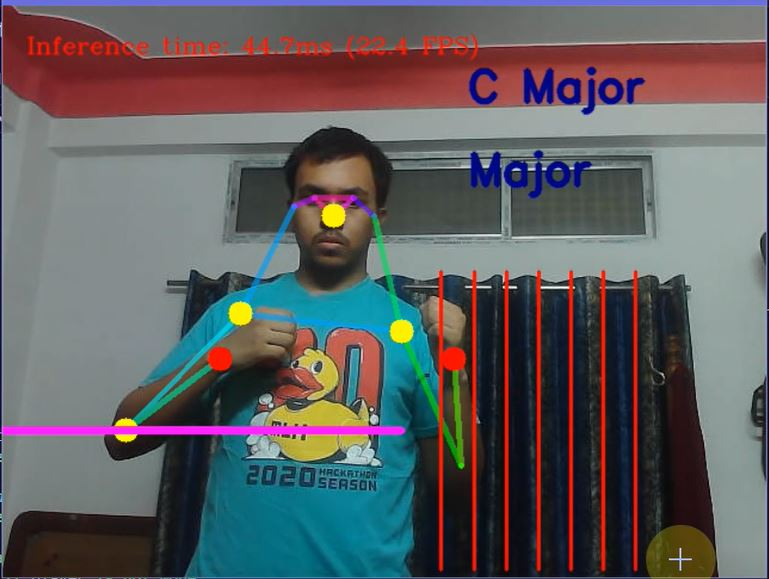
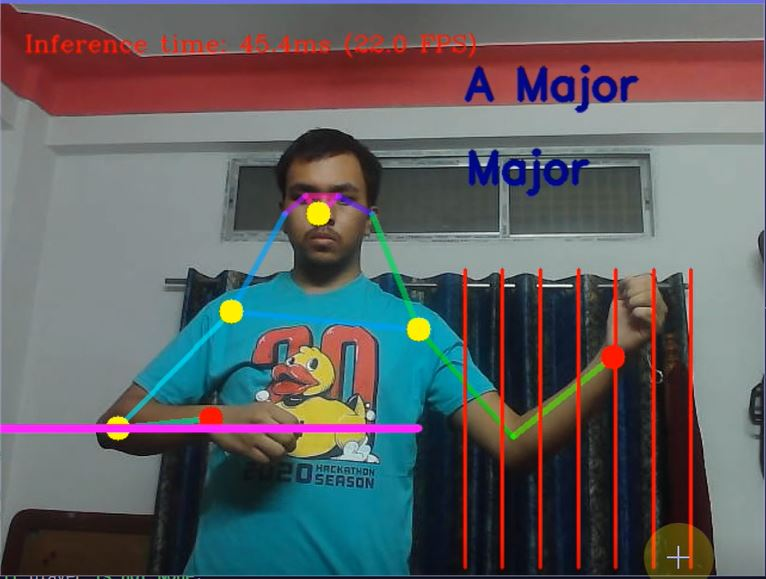

# air_guitar

# Air Guitar using Openpose, OpenVINO and OpenCV in Python

## Software Used
- Python 3.x

## Libraries Used 
- opencv (pip install opencv-python)
- playsound (Use pip install playsound==1.2.2 )
- openvino ([Installation Steps](https://docs.openvino.ai/2021.1/openvino_docs_install_guides_installing_openvino_windows.html))

## Clone this Repository 
``` git clone https://github.com/nilutpolkashyap/air_guitar.git -b openvino_openpose ```

## Output
<div align="center">

</div>
<div align="center">

</div>

## Output Video🎬 - https://youtu.be/jAbdUZQsDHc

## Project Created by - 
- Nilutpol Kashyap - [nilutpolkashyap](https://github.com/nilutpolkashyap)

Intel Devmesh Project Link - _To Be updated soon_

Guitar Chords collected from 
 [https://sampleswap.org](https://sampleswap.org/filebrowser-new.php?d=INSTRUMENTS+%28MULTISAMPLED%29%2FGUITAR%2Fclean+electric+guitar+chords%2F)


